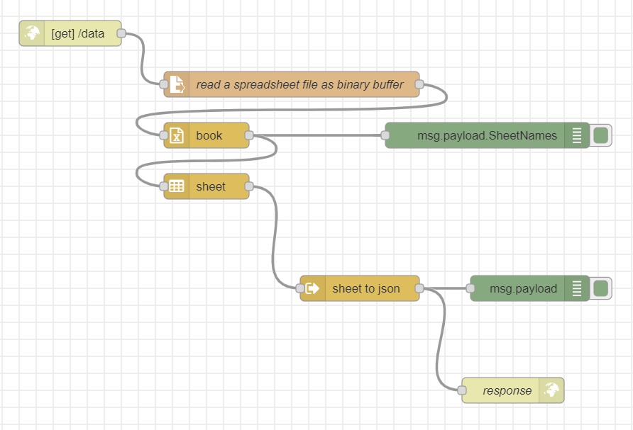
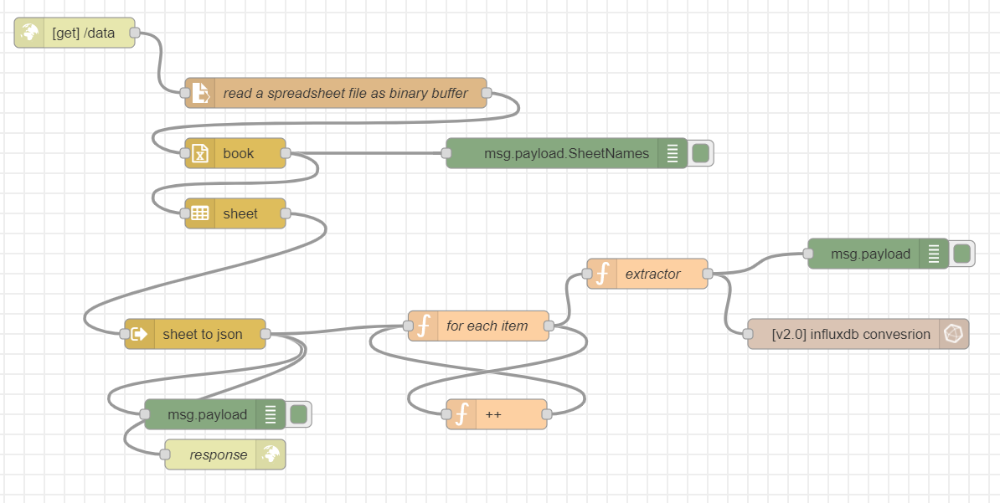

# data-visualization
- refer to [instructions](https://github.com/Onunda/nig-stack) to set stack in docker
## Docs

- [Grafana docs](https://grafana.com/docs/)

- [Node-red docs](https://nodered.org/docs/)

- [InfluxDB docs](https://docs.influxdata.com/)

## Useful resources

- [Youtube resources](https://youtube.com/playlist?list=PLviskRVPQfMUkYqUomQZiT95qjk7a5Wf1)

- [CSV file sample](https://assets.publishing.service.gov.uk/government/uploads/system/uploads/attachment_data/file/1105317/ghg-conversion-factors-2022-flat-format.xls)

- [Node-red reads spreadsheet files](https://flows.nodered.org/node/node-red-contrib-spreadsheet-in)

## Data Visualization worklfow

### Node-red flow
#### Read data from a spreadsheet and convert cells into a json file
- run node-red
- import the given [flow](./flows/flow1.json)
- deploy it
- download [spreadsheet](https://assets.publishing.service.gov.uk/government/uploads/system/uploads/attachment_data/file/1105317/ghg-conversion-factors-2022-flat-format.xls) and specify the path of this file in the flow (file node), you may copy this file to container if you are using docker
- call api localhoat:[port]/data

#### Read data from a spreadsheet and send each value one by one to influx
- same steps as mentioned above
- setup influx first
- create bucket in influxDB and connect it to your influx node
- import the given [flow](./flows/flow2.json)

